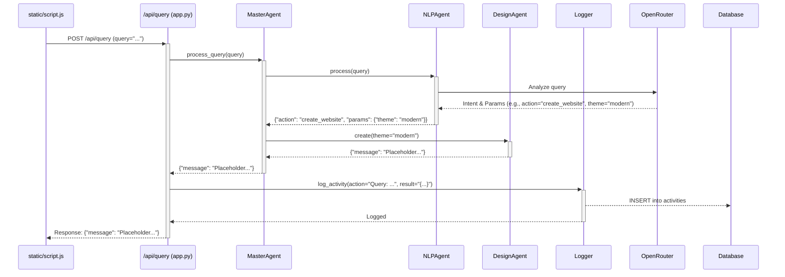

# Project Enhancement Plan

**Goal:** Enhance the application with NLP-driven actions, image editing, multi-file uploads, activity logging, and UI updates using FastAPI, OpenRouter, SQLite, and Pillow.

---

## Phase 1: Backend Implementation

1.  **Update Dependencies (`requirements.txt`):**
    *   Add `Pillow` for image manipulation.
    *   Ensure `fastapi`, `uvicorn`, `python-dotenv`, `requests`, `PyGithub`, `openrouter-python`, `sqlite3` (standard library, no add needed) are present.

2.  **Create Logging System (`logging_system.py`):**
    *   Define `Logger` class using `sqlite3`.
    *   `__init__`: Connect to `activity.db`, call `create_table`.
    *   `create_table`: `CREATE TABLE IF NOT EXISTS activities (id INTEGER PRIMARY KEY, timestamp TEXT, action TEXT, result TEXT)`.
    *   `log_activity(action, result)`: Insert records.
    *   `get_logs(limit=50)`: Retrieve recent logs.

3.  **Enhance Agents (`ai_agents.py`):**
    *   **`NLPAgent`:**
        *   Create class, accept `OpenRouterClient` in `__init__`.
        *   `process(query)`: Use `client.chat.completions.create` (e.g., Mistral 7B Instruct) with a prompt to classify intent (e.g., "create_website", "edit_image", "unknown") and extract parameters. Parse response into `{"action": "...", "params": {...}}`. Handle errors.
    *   **`CodeAgent`:**
        *   Create class.
        *   `edit_image(image_bytes, filter_type)`: Use `Pillow` (`PIL`) to open image from bytes, apply filter (`convert("L")` for grayscale, basic sepia), save to `io.BytesIO`, return bytes. Handle errors.
    *   **`DesignAgent`:**
        *   Create class.
        *   `create(theme)`: Return placeholder `{"message": f"Placeholder: Website with theme '{theme}' creation initiated."}`.
    *   **`MasterAgent`:**
        *   Modify `__init__`: Instantiate `NLPAgent`, `CodeAgent`, `DesignAgent`. Store in `self.agents = {"nlp": ..., "code": ..., "design": ...}`.
        *   Implement `process_query(query)`: Call `self.agents["nlp"].process(query)`. Based on `action`, call `DesignAgent` or return message for image editing (`"Please use the image upload endpoint..."`). Handle "unknown". Return result.

4.  **Update API (`app.py`):**
    *   Import `Logger`, `List`, `UploadFile`, `File`, `Form`, `HTTPException`, `StreamingResponse`, `io`.
    *   Instantiate `logger = Logger()`.
    *   Create `uploads/` directory if not exists. Add to `.gitignore`.
    *   **`/api/query` (POST):** Accept `query: str = Form(...)`. Call `master.process_query(query)`. Call `logger.log_activity(...)`. Return result.
    *   **`/api/upload` (POST):** Accept `files: List[UploadFile] = File(...)`. Loop, `await file.read()`, save file (e.g., `uploads/`), log activity. Return success message.
    *   **`/api/edit_image` (POST):** Accept `file: UploadFile = File(...)`, `filter_type: str = Form("grayscale")`. Read bytes. Call `master.agents["code"].edit_image(...)`. Handle errors (`HTTPException`). Log activity. Return `StreamingResponse(io.BytesIO(edited_image_bytes), media_type="image/png")`.
    *   **`/api/logs` (GET):** Call `logger.get_logs()`. Return logs.

---

## Phase 2: Frontend Implementation

5.  **Update Frontend (`static/script.js`):**
    *   **Query Form:** Input, button. On submit: Show loading, `fetch` POST to `/api/query`, display result, hide loading. Handle errors.
    *   **Image Edit Form:** File input, filter select, button. On submit: Show loading, `FormData`, `fetch` POST to `/api/edit_image`, display response image blob via `URL.createObjectURL()`, hide loading. Handle errors.
    *   **Multi-File Upload Form:** File input (`multiple`), button. On submit: Show loading, `FormData` loop, `fetch` POST to `/api/upload`, display message, hide loading.
    *   **Activity Log Display:** Button. On click: `fetch` GET `/api/logs`, format and display logs.

---

## Phase 3: Docker & Testing

6.  **Update `Dockerfile`:**
    *   Add `RUN apt-get update && apt-get install -y libjpeg-dev zlib1g-dev || true` (or equivalent for Pillow dependencies).
    *   Ensure `requirements.txt` copy/install.

7.  **Testing:**
    *   Test UI: Query, Image Edit (grayscale/sepia), Multi-upload, Logs display.
    *   Verify `activity.db` entries.
    *   Verify existing file logs still work.

---

## Diagrams

**Component Interaction:**

```mermaid
graph TD
    UserInterface[static/script.js] -- Query --> API_Query[/api/query]
    UserInterface -- Image + Filter --> API_EditImage[/api/edit_image]
    UserInterface -- Multiple Files --> API_Upload[/api/upload]
    UserInterface -- Request Logs --> API_Logs[/api/logs]

    API_Query -- process_query() --> MasterAgent[ai_agents.MasterAgent]
    API_EditImage -- edit_image() --> CodeAgent[ai_agents.CodeAgent]
    API_Upload -- Saves Files --> FileSystem[uploads/]
    API_Logs -- get_logs() --> Logger[logging_system.Logger]

    MasterAgent -- process() --> NLPAgent[ai_agents.NLPAgent]
    MasterAgent -- create() --> DesignAgent[ai_agents.DesignAgent]

    NLPAgent -- Uses --> OpenRouter[OpenRouter API]
    CodeAgent -- Uses --> Pillow[Pillow Lib]

    API_Query -- log_activity() --> Logger
    API_EditImage -- log_activity() --> Logger
    API_Upload -- log_activity() --> Logger
    Logger -- Reads/Writes --> Database[activity.db]

    subgraph FastAPI App (app.py)
        API_Query
        API_EditImage
        API_Upload
        API_Logs
    end

    subgraph Agents (ai_agents.py)
        MasterAgent
        NLPAgent
        CodeAgent
        DesignAgent
    end
```

**`/api/query` Flow:**



**`/api/edit_image` Flow:**

```mermaid
sequenceDiagram
    participant UI as static/script.js
    participant API as /api/edit_image (app.py)
    participant MA as MasterAgent
    participant CA as CodeAgent
    participant Log as Logger

    UI->>+API: POST /api/edit_image (file=image.jpg, filter_type="grayscale")
    API->>MA: Access master.agents["code"]
    API->>+CA: edit_image(image_bytes, filter_type="grayscale")
    CA->>Pillow: Open image, apply filter
    Pillow-->>CA: Edited image bytes
    CA-->>-API: edited_image_bytes
    API->>+Log: log_activity(action="Edit Image: ...", result="Success")
    Log-->>Database: INSERT into activities
    Log-->>-API: Logged
    API-->>-UI: Response: (Image Data)